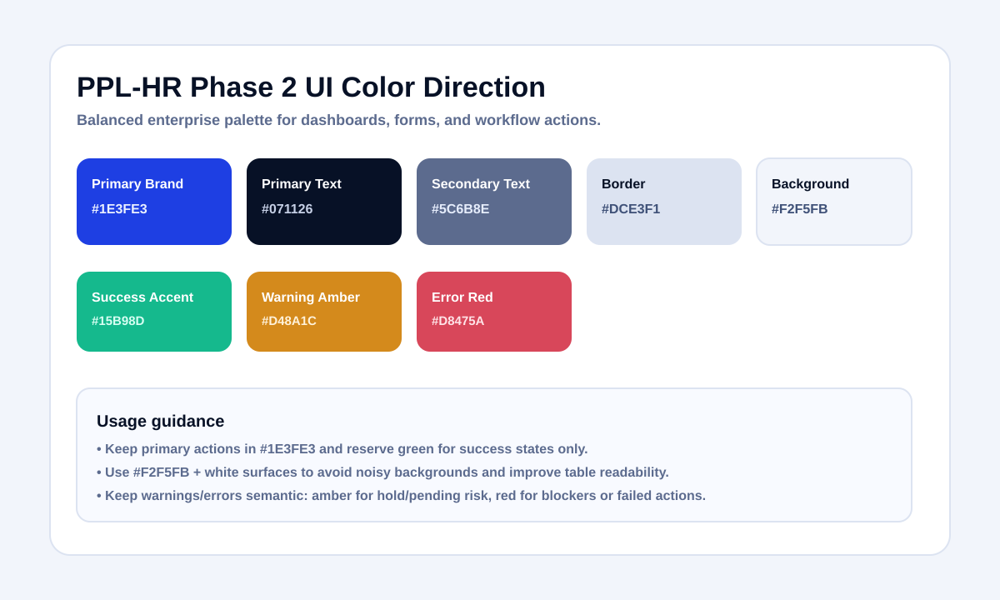

# Phase 2 UI Color Direction

Last updated: 2026-05-28

Recommended palette for the current product shell:

- Primary brand: `#1E3FE3`
- Primary text: `#071126`
- Secondary text: `#5C6B8E`
- Border: `#DCE3F1`
- Surface: `#FFFFFF`
- Background: `#F2F5FB`
- Accent mint (success-support): `#15B98D`
- Alert amber: `#D48A1C`
- Alert red: `#D8475A`

This keeps the UI premium and operational, with strong contrast and minimal visual noise.

